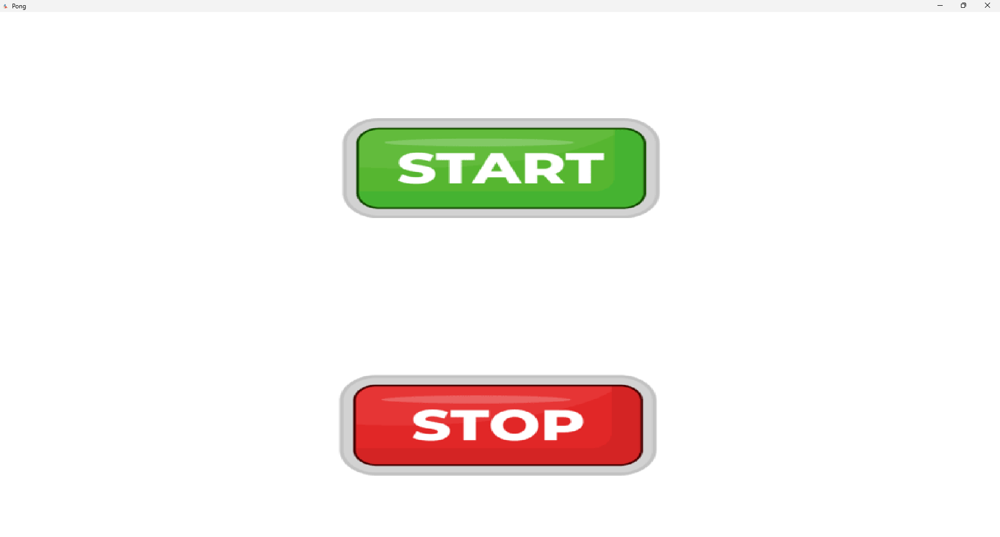

# 🏓 Ping Pong Raylib

<div align="center">



✨ A fun and simple Pong-style game built with **raylib** in C++ ✨

👩‍💻 Created by **Hana**  
🔗 GitHub: https://github.com/nonakarim

</div>

---

## 🚀 Features

- 🖥️ Resizable window
- 🎮 Dual control system  
  - Mouse control  
  - Keyboard control (W / S)
- 🤖 AI paddle that follows the ball
- ⚽ Real-time collision & physics
- 🔊 Sound effects & background music
- 🎯 Score system (first to 3 wins)
- 🧠 Game states (menu → gameplay → result)

---

## 🎮 Gameplay

- Click **Start** to begin
- Choose control method (Mouse or Keyboard)
- Beat the AI to reach 3 points first!

---

## 🧱 Project Structure

```
Ping_Pong_Raylib/
│
├── src/
├── include/
├── assets/
│   ├── images/
│   └── audio/
├── CMakeLists.txt
├── vcpkg.json
```

---

## ⚙️ Build Instructions

### 🔧 Requirements

- C++20
- CMake (>= 3.26)
- vcpkg
- raylib
- glfw3

### 📦 Install Dependencies

```
vcpkg install raylib glfw3
```

### 🛠️ Build

```
mkdir build
cd build
cmake .. -DCMAKE_TOOLCHAIN_FILE=[vcpkg path]/scripts/buildsystems/vcpkg.cmake
cmake --build .
```

### ▶️ Run

```
./Ping_Pong_Raylib
```

---

## 🎯 Controls

| Action        | Input              |
|--------------|-------------------|
| Move Paddle  | Mouse or W / S    |
| Start Game   | Mouse Click       |
| Exit Game    | Click Stop        |

---

## 💡 What This Project Shows

- Game loop design
- Collision detection
- Input handling
- Texture rendering (raylib)
- Audio integration
- Basic AI behavior

---

## 🌟 Credits

💖 Made with passion by **Hana**  
🔗 https://github.com/nonakarim

---

## ⭐ Support

If you like this project, consider giving it a ⭐ on GitHub!
